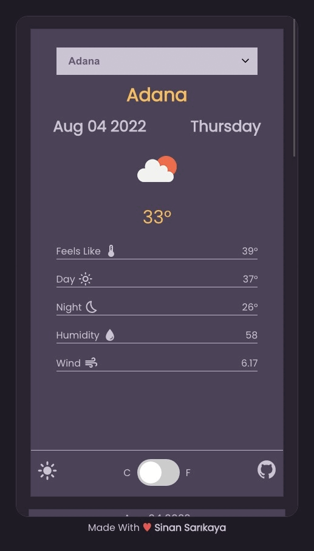

# React Weather App

(https://github.com/deepthi513/weather-ap)

Responsive weather app made using React

<hr />

### Installation Options

```
$ https://github.com/deepthi513/weather-ap
```

```
$ npm install
```

```
$ npm start
```

### Or

```
$ yarn
```

```
$ yarn start
```

<hr />

### Demo

![Demo] 

